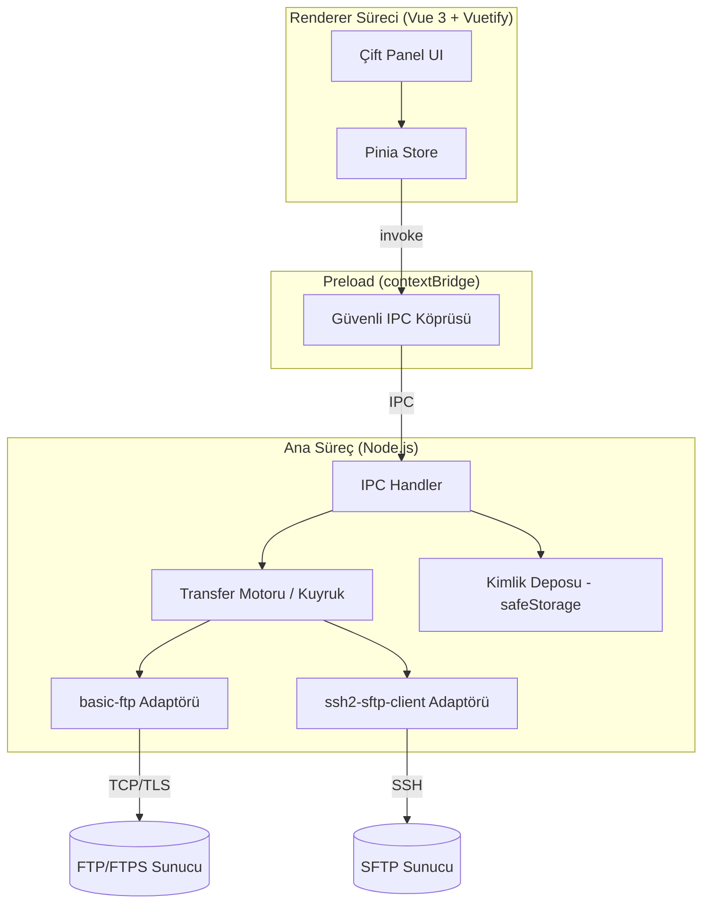

# FTP Client Geliştirme — Analiz ve Yol Haritası Raporu

**Hedef stack:** Vue.js (3) + Vuetify (3) + Node.js + TypeScript
**Tarih:** Haziran 2026

---

## 1. Yönetici Özeti

Modern bir FTP istemcisi aslında "tek bir protokol" değil, **üç farklı protokol ailesini** (FTP, FTPS, SFTP) tek arayüz altında toplayan bir uygulamadır. "Tüm FTP sunucularını desteklemek" cümlesinin gerçek anlamı şudur: protokol varyantlarını + sunucu davranış farklılıklarını (dizin listeleme formatları, aktif/pasif mod, karakter kodlaması, TLS çeşitleri) doğru şekilde ele almak.

**En kritik mimari karar:** Saf bir tarayıcı (browser) uygulaması FTP bağlantısı **kuramaz**. Tarayıcılar ham TCP soketine izin vermez. Bu yüzden Vue+Vuetify arayüzünüzün arkasında mutlaka bir Node.js katmanı çalışmalıdır. Sizin stack'iniz için en doğal çözüm **Electron** (masaüstü uygulama) mimarisidir; çünkü olgun Node.js FTP kütüphaneleri (`basic-ftp`, `ssh2-sftp-client`) doğrudan kullanılabilir.

---

## 2. Kritik Mimari Gerçek: Neden Node.js / Electron Şart?

FTP, FTPS ve SFTP'nin üçü de **ham TCP soketi** üzerinden çalışır:

| Protokol | Port (varsayılan) | Taşıma | Tarayıcıdan doğrudan erişim? |
|----------|-------------------|--------|------------------------------|
| FTP      | 21 (kontrol) + dinamik (veri) | Düz TCP | ❌ Hayır |
| FTPS     | 21 (explicit) / 990 (implicit) | TCP + TLS | ❌ Hayır |
| SFTP     | 22 | SSH üzerinden | ❌ Hayır |

Tarayıcı sandbox'ı yalnızca HTTP/HTTPS, WebSocket ve WebRTC'ye izin verir; `net.Socket` benzeri ham soket yoktur. Dolayısıyla iki olası mimari vardır:

1. **Electron masaüstü uygulaması (ÖNERİLEN):** FTP motoru Node.js ana sürecinde (main process) çalışır, Vue+Vuetify arayüzü renderer süreçte çalışır. İkisi IPC ile haberleşir. Kullanıcının makinesindeki yerel dosyalara da erişim gerekir — bu da masaüstü uygulamasını zorunlu kılar.
2. **Ayrı Node.js sunucusu + Vue web arayüzü:** Backend FTP işini yapar, frontend REST/WebSocket ile konuşur. Web tabanlı (SaaS) bir FTP yöneticisi istiyorsanız mantıklı; ancak kullanıcının **yerel dosyalarına** erişmek için tarayıcı yine kısıtlıdır (File System Access API sınırlı destekli). FileZilla benzeri klasik bir istemci hedefliyorsanız bu mimari uygun değildir.

> **Sonuç:** Klasik bir FTP istemcisi (yerel ↔ uzak dosya transferi) hedefliyorsanız **Electron** seçin.

---

## 3. Desteklenecek Protokoller (Öncelik Sırasıyla)

"Tüm FTP sunucuları" hedefi için kapsanması gereken protokol varyantları:

### Öncelik 1 — Olmazsa olmaz
- **FTP (düz, RFC 959):** Eski/güvensiz ama hâlâ yaygın. Temel komutlar: `USER`, `PASS`, `LIST/MLSD`, `RETR`, `STOR`, `CWD`, `PWD`, `DELE`, `MKD`, `RMD`, `RNFR/RNTO`, `SIZE`, `REST`.
- **FTPS Explicit (FTPES / `AUTH TLS`):** Modern güvenli standart. Port 21'de başlar, TLS'e yükseltilir. **Bunu varsayılan/önerilen mod yapın.**

### Öncelik 2 — Yaygın talep
- **SFTP (SSH File Transfer Protocol):** Teknik olarak FTP **değildir** (SSH alt sistemi), ama her ciddi "FTP istemcisi" bunu destekler. Sunucu yönetimi/hosting senaryolarında en çok kullanılan protokoldür. Ayrı bir kütüphane gerektirir.

### Öncelik 3 — Eski sistem uyumu
- **FTPS Implicit:** Standart dışı, eski (port 990). TLS bağlantının en başında kurulur. Bazı eski kurumsal sunucularda hâlâ var. `basic-ftp` bunu `secure: "implicit"` ile destekler.

---

## 4. "Tüm Sunucuları Desteklemek" — Gerçek Zorluklar

Asıl iş protokolü konuşmak değil, sunucular arası **davranış farklılıklarını** ele almaktır. FileZilla'nın yıllarca biriktirdiği olgunluğun büyük kısmı buradadır.

### 4.1 Aktif (Active) vs Pasif (Passive) Mod
- **Pasif mod (PASV/EPSV):** İstemci hem kontrol hem veri bağlantısını başlatır. NAT/firewall arkasındaki istemciler için zorunlu. Modern varsayılan budur.
- **Aktif mod (PORT/EPRT):** Sunucu istemciye geri bağlanır. Firewall arkasında genelde çalışmaz.
- ⚠️ **Dikkat:** Önerilen `basic-ftp` kütüphanesi **yalnızca pasif modu** destekler (IPv4 için PASV, IPv6 için EPSV). Aktif mod gereken nadir sunucular için ya genişletme noktası yazmanız ya da alternatif çözüm bulmanız gerekir. Pratikte pasif mod vakaların %95+'ini karşılar.

### 4.2 Dizin Listeleme Formatları (En Büyük Uyumluluk Sorunu)
FTP'de listeleme için **standart bir format yoktur.** Üç ana format vardır:
- **MLSD/MLST:** Makine-okunabilir, standartlaşmış (RFC 3659). Modern sunucularda tercih edilir. Mümkün olduğunda bunu kullanın.
- **Unix tarzı LIST:** `drwxr-xr-x 2 user group 4096 Jun 10 12:00 klasor` — `ls -l` çıktısı gibi.
- **DOS/Windows tarzı LIST (IIS):** `06-29-26 02:30PM <DIR> klasor`.

`basic-ftp` bu üç formatı da otomatik parse eder ve gerekirse özel parser eklemenize izin verir. Yine de tarih/saat dilimi, sembolik linkler, dosya izinleri gibi alanlarda sunucuya özgü tuhaflıklar olabilir.

### 4.3 Karakter Kodlaması (Encoding)
- Modern sunucular **UTF-8** kullanır (`OPTS UTF8 ON`). Bazı sunucular UTF-8 desteğini özelliklerinde belirtmese bile destekler.
- Eski sunucularda Latin-1, Windows-1254 (Türkçe), GBK vb. olabilir. Türkçe karakterli dosya adları (ç, ş, ğ, ü, ö, ı) için kodlamayı kullanıcının seçebilmesi iyi olur. `basic-ftp` kontrol bağlantısının encoding'ini ayarlamaya izin verir (varsayılan utf8).

### 4.4 TLS / Sertifika Varyantları
- Self-signed (kendinden imzalı) sertifikalar yaygındır → kullanıcıya "güven/gösterme" diyaloğu sunun (`rejectUnauthorized` ayarı).
- TLS 1.2 / 1.3 desteği, kontrol ve veri bağlantısının aynı TLS oturumunu paylaşması (session resumption) gibi konular.

### 4.5 IPv4 / IPv6
- PASV (IPv4) ve EPSV (IPv6) ayrımı. `basic-ftp` ikisini de yönetir.

### 4.6 Sunucu Çeşitleri (Test Matrisi)
Gerçek dünya uyumluluğu için şu sunuculara karşı test edin:
- **vsftpd** (Linux'ta en yaygın)
- **ProFTPD**
- **Pure-FTPd**
- **FileZilla Server** (Windows)
- **Microsoft IIS FTP** (DOS-tarzı listeleme!)
- **OpenSSH SFTP** (SFTP için referans)

### 4.7 Transferi Sürdürme (Resume)
- `REST` komutu + `SIZE` ile yarım kalan transferleri kaldığı yerden devam ettirme. Büyük dosyalarda kritik özellik. SFTP'de `fastGet/fastPut` offset desteği vardır.

### 4.8 Bağlantıyı Canlı Tutma (Keep-Alive)
- Uzun işlemlerde sunucunun zaman aşımıyla bağlantıyı düşürmesini önlemek için periyodik `NOOP` gönderimi.

---

## 5. Özellik Öncelikleri (Faz Faz Yol Haritası)

### Faz 1 — MVP (Minimum Çalışan Ürün)
- [ ] FTP + FTPS (explicit) ile bağlanma ve kimlik doğrulama
- [ ] Anonim giriş desteği
- [ ] Uzak dizin listeleme + gezinme (MLSD/Unix/DOS)
- [ ] Tek dosya indirme / yükleme
- [ ] Yerel dosya sistemi görünümü (Electron ile)
- [ ] Bağlantı/işlem log paneli (komut-yanıt akışı)
- [ ] Temel hata yönetimi ve durum bildirimleri

### Faz 2 — Profesyonel Çekirdek
- [ ] **Çift panel (dual-pane)** arayüz: sol yerel, sağ uzak — FileZilla mantığı
- [ ] **Sürükle-bırak** transfer
- [ ] **Transfer kuyruğu** (queue): birden çok dosya, ilerleme yüzdesi, hız (KB/s), kalan süre
- [ ] **Transferi sürdürme (resume)**
- [ ] Klasör (recursive) transferi
- [ ] Dosya işlemleri: sil, yeniden adlandır, klasör oluştur, izin değiştir (chmod)
- [ ] **SFTP** desteği
- [ ] **Site Yöneticisi (Site Manager):** kayıtlı bağlantılar, klasörlenmiş

### Faz 3 — İleri Düzey
- [ ] Paralel/çoklu eşzamanlı transfer (dikkat: tek FTP bağlantısı seri çalışır — havuz/pool gerekir)
- [ ] Dizin senkronizasyonu / mirror (tek yönlü ve çift yönlü)
- [ ] Sunucuda dosyayı yerelde aç → düzenle → otomatik geri yükle (edit-in-place)
- [ ] FTPS implicit + gelişmiş TLS seçenekleri
- [ ] SSH anahtarı (private key) ile SFTP kimlik doğrulama + host key doğrulama
- [ ] Bant genişliği sınırlama (throttling)
- [ ] Ana parola (master password) ile şifrelenmiş kimlik bilgisi deposu
- [ ] Yer imleri (bookmarks), arama/filtre, dosya karşılaştırma
- [ ] Çoklu dil (i18n) ve tema (Vuetify ile kolay)
- [ ] Otomatik güncelleme (auto-update)

---

## 6. Teknoloji Yığını Analizi

### 6.1 Masaüstü Kabuğu: Electron vs Tauri

| Kriter | Electron | Tauri 2 |
|--------|----------|---------|
| Backend dili | **Node.js (TypeScript)** ✅ | Rust |
| Node FTP kütüphaneleri | Doğrudan kullanılır ✅ | Doğrudan kullanılamaz (sidecar gerekir) |
| Uygulama boyutu | ~80–150 MB | ~3–10 MB |
| RAM kullanımı | ~150–300 MB | ~30–50 MB |
| Öğrenme eğrisi (JS ekibi) | Düşük ✅ | Rust öğrenme yükü |
| Ekosistem olgunluğu | Çok yüksek (VS Code, Slack, Discord) | Hızla büyüyor |

**Öneri: Electron.** Gerekçe: Sizin tüm stack'iniz Node.js + TypeScript. Olgun FTP/SFTP kütüphaneleri Node kütüphaneleridir. Tauri'nin Rust backend'i bu kütüphaneleri doğrudan kullanmanızı engeller; Node motorunu "sidecar binary" olarak paketlemek mümkündür ama gereksiz karmaşıklık katar.

> Boyut/RAM sizin için kritik bir müşteri gereksinimiyse ve ekip Rust'a yatırım yapabiliyorsa Tauri + Rust FTP crate'leri (`suppaftp`, `russh-sftp`) düşünülebilir — ama bu, belirttiğiniz "Node.js + TypeScript" hedefinden sapar.

### 6.2 Önerilen Tam Yığın

| Katman | Teknoloji |
|--------|-----------|
| Masaüstü kabuğu | **Electron** |
| Build aracı | **electron-vite** (Vite tabanlı, hızlı HMR) |
| Arayüz | **Vue 3** (Composition API + `<script setup>`) |
| UI bileşenleri | **Vuetify 3** |
| Dil | **TypeScript** (strict mode) |
| Durum yönetimi | **Pinia** |
| FTP/FTPS motoru | **basic-ftp** |
| SFTP motoru | **ssh2-sftp-client** (ssh2 üzerine) |
| Kimlik bilgisi şifreleme | Electron **safeStorage** API veya **keytar** |
| Paketleme | **electron-builder** |
| Test | **Vitest** + **Playwright** |

---

## 7. Önerilen Mimari

**Tasarım ilkeleri:**
1. **Protokol soyutlama katmanı:** FTP ve SFTP'yi tek bir ortak arayüz (`IFileTransferClient`) arkasına saklayın — `connect()`, `list()`, `download()`, `upload()`, `delete()`, `rename()`, `mkdir()`. UI hangi protokolün kullanıldığını bilmesin. Bu, kod tekrarını önler ve ileride yeni protokol eklemeyi kolaylaştırır.
2. **FTP seri çalışır:** Tek bir FTP kontrol bağlantısı aynı anda tek istek işler. Paralel transfer için **bağlantı havuzu** (her transfer için ayrı bağlantı) kurun.
3. **IPC üzerinden ilerleme akışı:** Transfer ilerlemesini ana süreçten renderer'a olay (event) olarak akıtın (`webContents.send`).
4. **Güvenlik:** `nodeIntegration: false`, `contextIsolation: true`, tüm Node erişimi yalnızca preload'daki `contextBridge` üzerinden.

---

## 8. Kütüphane Notları (Güncel Durum)

- **basic-ftp:** Modern, Promise/async-await tabanlı, TypeScript ile yazılmış. FTPS over TLS, IPv6 pasif mod, MLSD/Unix/DOS listeleme parse desteği. **Yalnızca pasif mod** (aktif mod yok). Tek bağımlılık Node.js. Bakımı aktif. FTP istemcileri için günümüzde en sağlam Node seçeneği.
- **ssh2-sftp-client:** `ssh2` paketinin Promise tabanlı sarmalayıcısı. Güncel sürüm v12.x, **Node 20+** gerektirir. Şifre ve özel anahtar (private key) ile kimlik doğrulama, `fastGet/fastPut`, `list`, `stat` vb. ⚠️ Host key doğrulamasını **varsayılan olarak yapmaz** — üretimde host key parmak izini doğrulamayı/sabitlemeyi siz eklemelisiniz.
- **ssh2:** Saf JavaScript SSH2 implementasyonu; ssh2-sftp-client'ın altında çalışır. İleri seviye ihtiyaçlar için doğrudan da kullanılabilir.

---

## 9. Güvenlik Kontrol Listesi

- [ ] Kimlik bilgilerini **asla** düz metin saklamayın → Electron `safeStorage` (OS keychain'e bağlanır) veya `keytar`.
- [ ] FTPS/SFTP'yi varsayılan/önerilen yapın; düz FTP için kullanıcıyı güvenlik konusunda uyarın.
- [ ] SFTP'de **host key doğrulama** (TOFU — Trust On First Use + parmak izi gösterme).
- [ ] Self-signed TLS sertifikalarında kullanıcıya açık onay diyaloğu.
- [ ] Electron sertleştirmesi: `contextIsolation`, `sandbox`, `nodeIntegration: false`, sıkı CSP.
- [ ] FTP bounce saldırılarına karşı `allowSeparateTransferHost` varsayılan kapalı kalsın (basic-ftp zaten kapalı tutar).
- [ ] Üretimde kod imzalama (Windows + macOS) — imzasız uygulamalar güvenlik uyarısı verir.

---

## 10. Önerilen Geliştirme Sırası (Sprint Mantığı)

1. **Sprint 0:** electron-vite + Vue 3 + Vuetify 3 + TypeScript + Pinia iskeleti; IPC köprüsü; temel pencere.
2. **Sprint 1:** `basic-ftp` ile FTP/FTPS bağlan + dizin listele + tek dosya indir/yükle (MVP).
3. **Sprint 2:** Çift panel UI + sürükle-bırak + transfer kuyruğu + ilerleme/hız göstergesi.
4. **Sprint 3:** Dosya işlemleri (sil/rename/mkdir/chmod) + resume + recursive klasör transferi.
5. **Sprint 4:** SFTP entegrasyonu (ortak arayüz arkasında) + host key doğrulama.
6. **Sprint 5:** Site Yöneticisi + şifreli kimlik deposu + ana parola.
7. **Sprint 6:** Senkronizasyon, edit-in-place, bant genişliği sınırı, i18n, auto-update.
8. **Sürekli:** Sunucu test matrisine (vsftpd, ProFTPD, Pure-FTPd, IIS, FileZilla Server, OpenSSH) karşı uyumluluk testleri.

---

## 11. Başlıca Riskler ve Dikkat Noktaları

| Risk | Etki | Azaltma |
|------|------|---------|
| Dizin listeleme format farklılıkları | Yanlış/eksik listeleme | MLSD'i tercih et; basic-ftp parser'ına güven; IIS'i mutlaka test et |
| Aktif mod gerektiren sunucular | Bazı sunucularda transfer başarısız | Pasif modu varsayılan yap; nadir vakalar için kullanıcıyı bilgilendir |
| FTP'nin seri doğası | Paralel transfer beklentisi karşılanmaz | Bağlantı havuzu kur |
| Türkçe/UTF-8 olmayan dosya adları | Bozuk karakterler | Encoding seçeneği sun |
| Büyük dosyalarda bellek | Çökme | Stream tabanlı transfer (belleğe tüm dosyayı yükleme) |
| Kimlik bilgisi sızıntısı | Güvenlik ihlali | OS keychain + şifreleme |
| Electron uygulama boyutu | Büyük indirme | Kabul edilebilir; gerekirse ileride Tauri değerlendir |

---

## 12. Sonuç ve Net Öneri

1. **Mimari:** Electron tabanlı masaüstü uygulaması (Vue 3 + Vuetify 3 + TypeScript renderer'da, FTP motoru Node ana süreçte).
2. **Protokol önceliği:** Önce FTP + FTPS explicit → sonra SFTP → en son FTPS implicit.
3. **Kütüphaneler:** `basic-ftp` (FTP/FTPS) + `ssh2-sftp-client` (SFTP), ortak bir `IFileTransferClient` arayüzü arkasında.
4. **"Tüm sunucu desteği"nin anahtarı:** protokol değil, **uyumluluk detayları** — pasif mod, listeleme formatları, encoding, TLS varyantları. Gerçek bir test matrisi kurun.
5. **Yol haritası:** MVP (bağlan + listele + tek dosya) ile başlayın, çift panel + kuyruk ile profesyonelleştirin, sonra SFTP ve ileri özellikleri ekleyin.

> Bu, tek seferde değil; iteratif inşa edilecek bir üründür. MVP'yi 2–4 haftada ayağa kaldırıp gerçek sunuculara karşı test ederek başlamak en sağlıklı yoldur.